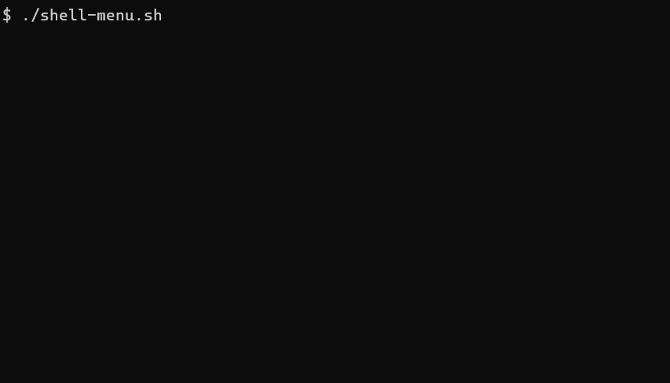

# Shell-Menu

Most of time, we use the command line (CLI) way to control PC. However, it is not an easy way for beinginner to use lots of command. So I make a tool to display a menu in CLI to manage commands. Using the menu type can manage commands more easily.

## Demo


## How to Use
- A menu have 4 parameters as below:
    - Title
    - Item Count
    - Item
    - Function

- Use "init_menu" funtion to create a new menu.

```bash
source ./function/fun.sh

title="MENU"
item=( "Exit" "Function-1" "Function-2" "Function-3" "test menu")
func=( EXIT fun1 fun2 fun3 menu-test)

init_menu $title "${#item[@]}" "${item[@]}" "${func[@]}"
```


## Support Shell
- bash
- sh